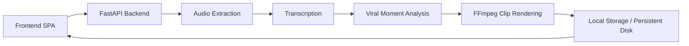

<<<<<<< HEAD
# 🎬 Viralix

> AI-powered short-form video clipping platform that transforms long-form videos into engaging, captioned vertical clips for social media.


---

# 📖 Overview

Viralix is an AI-assisted video processing platform designed to automate the creation of short-form content from long videos.

The application accepts uploaded videos or supported sources, extracts audio, performs transcription, identifies engaging moments, generates captions, and produces social-media-ready vertical clips.

The project demonstrates full-stack development, AI integration, authentication, Docker containerization, and automated deployment workflows.

---

# ✨ Features

* 🔐 JWT Authentication
* 🎥 Video Upload Pipeline
* 📝 Automatic Speech Transcription
* 🤖 AI-assisted Clip Selection
* ✂️ Automatic Video Clipping
* 💬 Caption Generation & Burn-in
* 📱 Vertical Video Output
* 📦 Docker Support
* 🚀 CI/CD with GitHub Actions
* ☁️ Render Deployment Blueprint
* 📊 Job Status Tracking
* 📥 Downloadable Processed Clips

---

# 🏗 Architecture

```text
                +------------------+
                | React Frontend   |
                +---------+--------+
                          |
                    REST API Calls
                          |
                +---------v--------+
                | FastAPI Backend  |
                +---------+--------+
                          |
          +---------------+----------------+
          |               |                |
     Authentication   Video Pipeline   Job Manager
          |               |                |
          |        FFmpeg Processing       |
          |               |                |
          |        AI Transcription        |
          |               |                |
          +---------------+----------------+
                          |
                    Generated Clips
                          |
                    Download Endpoint
```

---

# 🛠 Tech Stack

## Frontend

* React
* TypeScript
* React Router
* Axios
* Framer Motion
* Tailwind CSS

## Backend

* FastAPI
* SQLAlchemy
* Pydantic
* JWT Authentication
* Passlib
* Uvicorn

## AI & Media Processing

* FFmpeg
* Whisper / OpenAI Transcription
* Anthropic Integration
* yt-dlp

## DevOps

* Docker
* Docker Compose
* GitHub Actions
* Render Blueprint

---

# 🚀 Installation

## Clone

```bash
git clone https://github.com/udishgt/viralix.git
cd viralix
```

---

## Backend

```bash
cd backend

python -m venv .venv

source .venv/bin/activate
# Windows:
# .venv\Scripts\activate

pip install -r requirements.txt

uvicorn server:app --reload
```

---

## Frontend

```bash
cd frontend

npm install

npm start
```

---

# 🐳 Docker

Build:

```bash
docker build -f backend/Dockerfile -t viralix .
```

Run:
=======
# Viralix

Automated short-form video clip generation for creators, editors, and social teams. Viralix ingests a source video or YouTube URL, transcribes the audio, finds high-retention moments, cuts vertical clips, burns captions, and serves downloadable outputs through a web app.

## Features

- YouTube URL and MP4 upload support
- JWT-based authentication with refresh tokens
- Transcript generation with local Whisper or optional AI providers
- Viral-moment detection using heuristics or Anthropic when configured
- FFmpeg-powered vertical clip generation
- Caption burning with two-line subtitle safety constraints
- Job history, clip preview, and downloadable outputs
- Dockerized backend and automated GitHub Actions workflows

## Architecture Overview

Viralix follows a simple monorepo architecture:

1. The React frontend submits an upload or URL.
2. The FastAPI backend accepts the job, stores metadata, and starts the pipeline.
3. FFmpeg extracts audio, trims clips, and burns captions.
4. The transcript and generated clips are stored on disk.
5. The frontend polls for status and renders job progress and results.



## Tech Stack

### Frontend
- React 19.2.5
- TypeScript
- React Router DOM 7.14.1
- Axios, Framer Motion, React Hot Toast, React Dropzone
- Create React App build tooling

### Backend
- Python 3.11
- FastAPI
- Uvicorn
- SQLAlchemy
- Pydantic
- Passlib
- python-jose
- yt-dlp
- FFmpeg

### Optional AI / Transcription Providers
- Anthropic
- OpenAI
- AssemblyAI

## Installation Instructions

### Prerequisites
- Python 3.11+
- Node.js 18+
- FFmpeg installed and available on PATH, or set `FFMPEG_PATH`

### Backend

```bash
cd backend
python -m venv .venv
.venv\Scripts\activate
pip install -r requirements.txt
```

### Frontend

```bash
cd frontend
npm ci
```

## Local Development Setup

### Run the backend

```bash
cd backend
uvicorn server:app --reload --host 0.0.0.0 --port 8000
```

### Run the frontend

```bash
cd frontend
npm start
```

By default, the frontend targets `http://localhost:8000`. To point it at another backend, set `REACT_APP_API_URL` before building or starting the frontend.

## Docker Usage

### Build and run with Docker Compose
>>>>>>> 55eabb9 (Polish repository for public portfolio)

```bash
docker compose up --build
```

<<<<<<< HEAD
---

# ⚙️ Environment Variables

Create a `.env` file using the following template:

```env
JWT_SECRET_KEY=your-secret-key

OPENAI_API_KEY=your-openai-key

ANTHROPIC_API_KEY=your-anthropic-key

ASSEMBLYAI_API_KEY=your-assemblyai-key

FFMPEG_PATH=/usr/bin/ffmpeg

REACT_APP_API_URL=http://localhost:8000
```

Never commit secrets to version control.

---

# 📡 API Overview

## Authentication

```
POST /auth/signup

POST /auth/login

POST /auth/logout

POST /auth/refresh
```

## Video Processing

```
POST /upload

GET /status/{job_id}

GET /jobs/{job_id}

GET /clips/{job_id}

GET /download/{job_id}/{filename}
```

---

# 📸 Screenshots

## Dashboard

*(Add screenshot here)*

---

## Upload Workflow

*(Add screenshot here)*

---

## Generated Clips

*(Add screenshot here)*

---

## Authentication

*(Add screenshot here)*

---

# ☁️ Deployment

The project includes:

* Docker support
* Docker Compose
* Render Blueprint (`render.yaml`)
* GitHub Actions CI/CD

Supported deployment targets:

* Render
* Google Cloud Run
* Railway
* Fly.io
* Self-hosted Docker

---

# 🧪 Local Development

Backend tests:

```bash
pytest
```

Frontend production build:

```bash
npm run build
```

Docker build:

```bash
docker build -f backend/Dockerfile .
```

---

# 🔮 Future Improvements

* PostgreSQL support
* Redis-backed job queue
* Background worker service
* S3-compatible object storage
* Multi-language transcription
* Team workspaces
* OAuth login
* Analytics dashboard
* Automatic social media publishing
* AI-powered title and hashtag generation

---

# 📁 Project Structure

```text
backend/
frontend/
uploads/
outputs/
.github/
Dockerfile
docker-compose.yml
render.yaml
README.md
```

---

# 🤝 Contributing

Contributions, suggestions, and bug reports are welcome.

Please open an issue or submit a pull request for improvements.

---

# 📄 License

This project is licensed under the MIT License.

---

# 👨‍💻 Author

**Udish Gupta**

* AI & Full-Stack Developer
* Passionate about Generative AI, Automation, and Scalable Web Applications

GitHub:
https://github.com/udishgt

LinkedIn:
(Add your LinkedIn profile here)

---

# ⭐ Portfolio Note

This project was built as a production-oriented AI video processing platform showcasing:

* Full-stack development
* AI integration
* Authentication systems
* Docker containerization
* CI/CD automation
* Cloud deployment
* Media processing pipelines

If you found this project interesting, consider giving it a ⭐ on GitHub.
=======
The backend container listens on `PORT` when deployed on Render and defaults to `8000` locally.

## Deployment Options

- **Render:** Recommended for the backend. Use `render.yaml` for the backend Docker service and the static frontend site.
- **GitHub Pages:** Suitable for the frontend only if you keep a static export approach.
- **Fly.io:** Good alternative for the backend if you want an always-on container.
- **Vercel / Netlify:** Good for the frontend, but less ideal for this backend pipeline.

## Environment Variables

Use placeholders only. Do not commit real secrets.

### Backend

- `JWT_SECRET_KEY` - JWT signing secret
- `FFMPEG_PATH` - Optional FFmpeg binary override
- `VIRALIX_DATA_DIR` - Base directory for uploads, outputs, and jobs metadata
- `ANTHROPIC_API_KEY` - Optional Anthropic access key
- `OPENAI_API_KEY` - Optional OpenAI access key
- `ASSEMBLYAI_API_KEY` - Optional AssemblyAI access key

### Frontend

- `REACT_APP_API_URL` - Backend base URL used by the frontend

### Render / CI

- `RENDER_API_KEY` - Render API token for workflow-triggered deploys
- `RENDER_SERVICE_ID` - Render service identifier for deploy triggers

## Screenshots

Add your project screenshots here after deployment.


## API Overview

### Authentication
- `POST /auth/signup`
- `POST /auth/login`
- `POST /auth/logout`
- `POST /auth/refresh`
- `GET /auth/me`

### Jobs and clips
- `POST /upload`
- `GET /status/{job_id}`
- `GET /jobs/{job_id}`
- `GET /clips/{job_id}`
- `GET /history`
- `GET /download/{job_id}/{filename}`
- `PATCH /jobs/{job_id}/clips/{rank}`
- `DELETE /jobs/{job_id}/clips/{rank}`
- `POST /jobs/{job_id}/clips/{rank}/regenerate`

### Health
- `GET /health`

## Future Improvements

- Move SQLite job persistence to managed Postgres
- Add object storage for generated clips and uploads
- Add a background worker queue for heavy processing
- Add silent-video handling instead of failing at audio extraction
- Add observability and structured logging
- Add user-facing caption editing and preview tools

## License

This repository currently does not include a formal license file. Add one before distributing the project publicly. If you want a simple open-source default, MIT is a common choice.

## Author

Maintained by [udishgt](https://github.com/udishgt).
>>>>>>> 55eabb9 (Polish repository for public portfolio)
